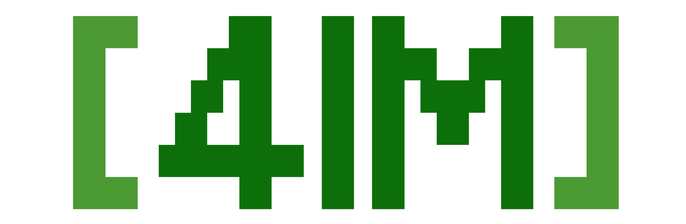

  

**English** | [简体中文](README_zh-CN.md) | [日本語](README_jp.md)

This project is based on the publicly available [4chan source code](https://github.com/zearp/4chan) ([my fork](https://github.com/Diamochang/4chan-fixed)) and [Vichan](https://github.com/vichan-devel/vichan). It aims to leverage pre-existing open-source anonymous imageboard projects, cutting-edge generative AI technology, and my PHP development skills to provide a secure, highly customizable, and internationalized 4chan-like platform tailored for Asian cultures and preferences. With 4im, you can easily set up your own 4chan-style anonymous imageboard without restrictions.

> [!IMPORTANT]
> This project is 100% independent of 4chan, and the creator has never worked for 4chan. Any site built using this project **is not equivalent to 4chan**, as their community characteristics are fundamentally different. **The creator and contributors of this project bear no responsibility for any non-technical issues that may arise from using websites built with this project.**

## Background
On April 14, 2025, 4chan was hit by a severe cyberattack from a hacker group, causing the site to crash within a day. The personal information of all 4chan administrators was leaked, and the source code appeared on Kiwi Farms shortly after. Some YouTubers later claimed this attack signaled the death of 4chan, though the site eventually recovered.

But the story didn’t end there. On April 16, a GitHub account named "4chan-org" emerged and released 4chan’s source code under the GNU General Public License version 3 (later moved to zearp’s account due to a DMCA notice, while the original account continued hosting the code under the "yotsuba" repository). I didn’t verify if this code matched the leaked version on Kiwi Farms. On April 19, I stumbled upon a YouTube video discussing the attack, which led me to the GitHub repository. After skimming the code and issues, I was shocked: a site so iconic in internet culture didn’t use Composer, and its code quality, judging by other users’ feedback, was a mess. Since the code was released under a free and open-source license, I decided to refactor it for everyone (especially Asian webmasters) to use, and that’s how this project came to be.

## Other open source projects used
- Composer ([Official website](https://getcomposer.org/) | [Source code](https://github.com/composer/composer))
- Vichan ([Official website](https://vichan.info/) | [Source code](https://github.com/vichan-devel/vichan))
- PHP CS Fixer ([Official website](https://cs.symfony.com) | [Source code](https://github.com/PHP-CS-Fixer/PHP-CS-Fixer))
- PHPStan ([Official website](https://phpstan.org/) | [Source code](https://github.com/phpstan/phpstan))  

## To-do list
- [ ] Improve Vichan-derived code
- [ ] Make the UI much closer to 4chan
- [ ] Add Asian flair
- [ ] Re-internationalize

## Help / Support Me
As I am a high school student, I am inevitably busy with school and have to find time to improve this hobby project. If you’re feeling generous, feel free to jump in and help via pull requests or suggest tools that could speed things up for me. I hope that with everyone working together, everyone can have a Asian-flavored 4chan of their own.

You can hit me up via the email listed on my profile, Matrix, or whatever floats your boat. If you want to use PGP, my fingerprint is `618f8cbf95f6eaa3b7a9d6d610ecf5f8be40a8ce`.

## License
GNU Affero General Public License version 3 or any later version. A copy of the license is [included](LICENSE) in the repository.